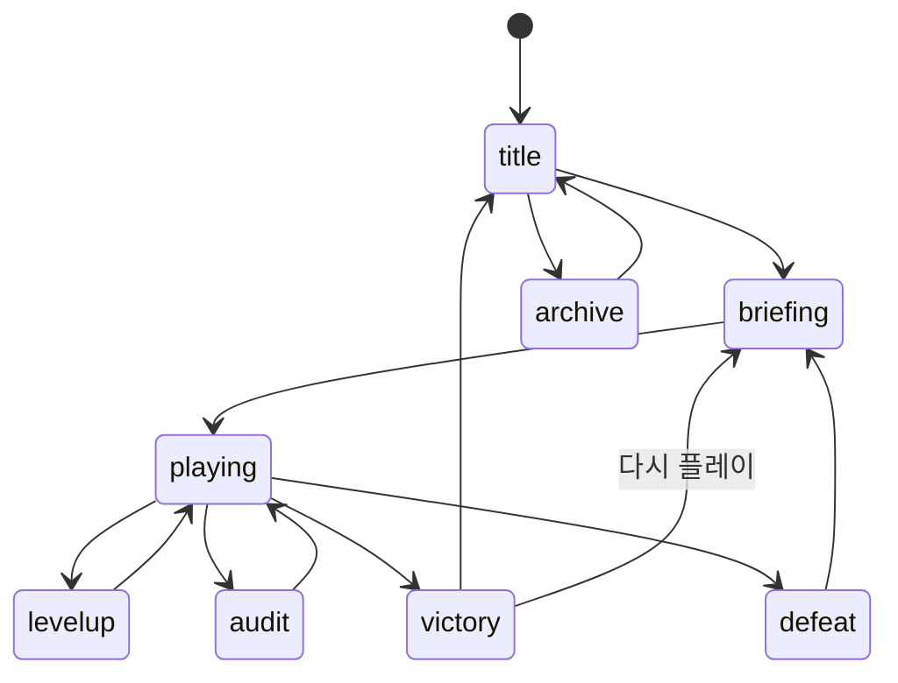

# NEON BREACH V2 제품 계약

> 날짜: 2026-07-19
>
> 대상: `영점손해사정` CHAPTER 1 수직 슬라이스
>
> 상태: **HG-01 권장안 승인 완료**
>
> 목적: 사람이 결정해야 할 항목을 최소한의 게이트로 묶고, 승인된 게이트 사이에서는 계획·구현·평가·수정을 자동으로 이어간다.

## 1. 현재 부족분 재분류

기존 부족분은 증상 10개가 아니라 네 개의 구조 문제로 묶는다.

| 구조 문제 | 포함되는 부족분 | 현재 판정 |
|---|---|---|
| 캠페인 수명주기 부재 | 챕터/런 상태, 저장·진행도, 새로고침 재시작 | P0, 미해결 |
| 서사 오케스트레이션 부재 | 실제 서사, 전달 UI, 스테이지 이벤트, 문서 기준선 | 서사 문서는 해결, 런타임은 P0 |
| 검증 계약 부재 | 테스트·lint·CI, 브라우저 회귀 방지 | P1, 미해결 |
| 콘텐츠·배포 확장성 부족 | 단일 맵·보스·런, 번들 경고 | P2, CH1 이후 |

`실제 서사 없음`은 더 이상 문서 P0가 아니다. [V2.1 스토리 바이블](2026-07-19-neon-breach-v2-story.md)에 주인공, 적대자, 목적, 반전, 결말과 실제 CH1 대사가 있다. 남은 P0는 그 서사를 게임 상태와 UI에 안전하게 연결하는 구조다.

V1 문서에는 역사 배너를 추가했다. V1의 10분 수치는 보존하지만 V2 구현 기준으로 사용하지 않는다.

## 2. 권장 제품 기본값

HG-01에서 한 번에 승인할 권장안이다. 별도 이견이 없으면 이 값으로 고정한다.

| 결정 | 권장 기본값 |
|---|---|
| 제품 표기 | `NEON BREACH — 영점손해사정` |
| 첫 화면 하위 표기 | `CHAPTER 1: 8분의 유예` |
| 현재 산출물 | 내부 CH1 수직 슬라이스 |
| 공개 형태 | HG-02 통과 후 `CH1 공개 데모`; CH2는 예고만 표시 |
| 정사 | V2.1 스토리 바이블 v0.2 |
| 캠페인 | 5장, 첫 캠페인은 선형, 분기 엔딩 없음 |
| 첫 구현 범위 | CH1만 구현하고 CH2 진행 자격·예고를 저장 |
| 플랫폼 | 데스크톱 웹, 키보드 우선 |
| 입력 | WASD/방향키 이동, SPACE 복구, M 음소거 |
| 언어 | 한국어 |
| 톤 | 진지한 사이버 스릴러, 신체 훼손·고어 없음, 청소년 이상 |
| 런 길이 | 480초 후 감사 집행체 등장 |
| 저장 범위 | 런 사이 프로필만 저장; 실행 중 이어하기 없음 |
| 재도전 | 같은 사건의 비정사적 재시도, 페이지 새로고침 금지 |
| 외부 에셋 | CH1은 기존 코드 생성 비주얼·WebAudio 유지 |
| 새 콘텐츠 | 새 일반 적·완전 신규 보스·허브는 HG-02 전 금지 |

## 3. 휴먼 게이트

### HG-01 — 제품·정사 잠금

**시점:** 지금, 플레이어에게 보이는 V2 콘텐츠를 코드에 넣기 전.

**사람이 결정할 것:**

1. V2.1 스토리를 정사로 승인한다.
2. 제품 표기를 `NEON BREACH — 영점손해사정`으로 승인한다.
3. `내부 수직 슬라이스 → HG-02 통과 후 CH1 공개 데모` 순서를 승인한다.
4. 진지한 청소년 이상 톤과 고어 없음 원칙을 승인한다.

**권장 승인 문구:**

```text
HG-01 권장안대로 승인. V2.1 정사, 제품명 NEON BREACH — 영점손해사정,
내부 CH1 수직 슬라이스 후 검수 통과 시 공개 데모, 청소년 이상·고어 없음.
```

**차단 범위:** Phase 4의 실제 대사·서사 콘텐츠 연결 이후. 테스트, 상태 분리, 저장 기반은 먼저 구현할 수 있다.

### HG-02 — CH1 수직 슬라이스 사람 검증

**시점:** 자동 테스트·lint·빌드·브라우저 smoke와 에이전트 리뷰를 모두 통과한 뒤.

**사람에게 제공할 것:**

- 로컬 또는 미리보기 실행 링크
- 8분 전체 런 1회
- 변경 요약과 자동 검증 결과
- 알려진 P2 목록

**사람이 확인할 것:**

- 박해주가 누구이며 무엇을 구하려는지 설명할 수 있다.
- 여섯 번째 드론 파견이 구조 선택이자 전투력 손실로 느껴진다.
- 이도의 설계 책임과 세진의 운영·은폐 책임을 구분할 수 있다.
- 50% 감사 카드가 읽히며 보스 긴장감을 과도하게 끊지 않는다.
- 미확인 시민이 사기 요청자나 반전용 숫자로만 보이지 않는다.
- 다시 플레이할 때 이미 본 통신을 줄일 수 있다.

**차단 범위:** CH2 구현과 공개 데모 전환.

### HG-03 — 공개 배포

**시점:** 공개 브랜치를 `main`에 반영하기 전.

현재 `.github/workflows/deploy.yml`은 `main` 푸시를 GitHub Pages 배포로 연결한다. 따라서 `main` merge/push는 코드 관리가 아니라 공개 행위다.

HG-03은 최초 CH1 데모뿐 아니라 이후 **모든 공개 업데이트**에 반복 적용한다. 승인된 구현 범위 안의 개발은 연속 수행하되, 공개 대상·문구·알려진 결함은 배포마다 사람이 확인한다.

**사람이 결정할 것:**

- 공개 문구와 제품명
- CH2 `준비 중` 예고 노출 여부
- 민감성 편집 최종 확인
- 알려진 P2를 남긴 채 공개해도 되는지

### 조건부 게이트

다음 상황이 생길 때만 추가 승인을 받는다.

| ID | 조건 | 사람 결정 |
|---|---|---|
| HG-C1 | 기존 프로필을 버려야 하는 저장 스키마 변경 | 초기화, 마이그레이션, 백업 중 선택 |
| HG-C2 | 외부 이미지·음성·폰트 추가 | 저작권, 비용, 아트 방향 승인 |
| HG-C3 | 계정·서버·개인정보·과금 추가 | 범위와 운영 책임 승인 |
| HG-C4 | 분기 엔딩·새 플랫폼·대규모 범위 확대 | 제품 범위 재잠금 |

## 4. 휴먼 게이트가 아닌 것

다음은 계약 범위 안에서 에이전트가 자율적으로 결정하고 수정한다.

- 내부 파일명과 작은 모듈 경계
- 테스트 러너·lint 설정과 CI 연결
- P0/P1 리뷰 지적 수정
- 저장 값 검증, 손상 데이터 복구, 단방향 마이그레이션 구현
- 스토리 이벤트 큐와 위험 시 표시 지연 알고리즘
- 새로고침 없는 재시작 구현
- 브라우저 smoke와 8분 자동 진행 도구
- 현재 기준 이하의 성능 회귀 수정
- 문서와 코드의 단순 불일치 수정
- 승인된 브랜치 작업의 단계별 로컬 커밋

자동 검증이 실패하면 사람에게 선택지를 넘기지 않고 먼저 수정한다. 계약을 바꾸지 않고 해결할 방법이 없을 때만 멈춘다.

## 5. 상태 모델

### AppMode

화면과 일시정지 이유만 표현한다.

```text
title
briefing
playing
levelup
audit
victory
defeat
archive
```

허용 전이:



`audit`와 `levelup`에서 전투 틱은 멈춘다. 메뉴 표시 여부를 `RunState`에 섞지 않는다.

### RunState

한 번의 시도에만 존재하며 저장하지 않는다.

```js
{
  chapterId: 'ch1',
  elapsed: 0,
  blocks: 0,
  level: 1,
  xp: 0,
  bossSpawned: false,
  hackSuccessCount: 0,
  dispatchedDroneCount: 0,
  firedStoryEventIds: [],
  pendingStoryEventIds: [],
}
```

플레이어 HP, 무기, 패시브, 아군, 해킹 게이지와 적·투사체는 런타임 엔티티 상태다. 재시작 때 함께 초기화하지만 JSON 프로필로 직렬화하지 않는다.

### ProfileState

런 사이에 유지한다.

```js
{
  schemaVersion: 1,
  completedChapters: {},
  seenStoryEventIds: [],
  archiveEntryIds: [],
  communicationMode: 'full',
  settings: {
    muted: false,
  },
}
```

`availableChapterIds`는 저장하지 않고 현재 콘텐츠 레지스트리에서 계산한다. CH1 완료는 CH2 진행 자격을 만들지만, CH2 콘텐츠가 없으면 선택 화면에는 `다음 장 준비 중`만 표시한다.

`communicationMode`의 의미는 다음으로 고정한다. 첫 플레이 기본값은 `full`이며, CH1 결과 화면부터 변경할 수 있다.

| 값 | 재생 규칙 |
|---|---|
| `full` | 핵심·반응·튜토리얼 통신을 모두 재생 |
| `core` | 핵심 통신, 보스 절차, 감사 카드, 결과만 재생 |
| `off` | 비차단 통신을 숨기고 보스 절차, 감사 카드, 결과만 유지 |

`off`도 진행에 필요한 차단형 정보는 숨기지 않는다. `full → core → off`는 플레이어 설정이지 정사 분기가 아니다.

### ChapterDefinition

챕터 데이터는 실행 코드와 분리한다.

```js
{
  id: 'ch1',
  title: '8분의 유예',
  duration: 480,
  waves: [],
  boss: {},
  storyEvents: [],
}
```

### StoryEvent

```js
{
  id: 'ch1.time.0048',
  trigger: { type: 'time', at: 48 },
  presentation: 'comms',
  replay: 'profile-once',
  priority: 50,
  maxDelay: 8,
  payload: {},
}
```

허용 트리거:

- `chapter-start`
- `time`
- `first-hack`
- `hack-count`
- `boss-spawn`
- `boss-hp-ratio`
- `victory`
- `defeat`

콘텐츠 데이터에는 DOM 조작, 게임 객체 참조, 실행 콜백을 넣지 않는다. Director가 이벤트를 판정하고 UI·게임 시스템이 ID와 payload를 처리한다.

## 6. 저장 계약

- 저장 키: `neon-breach.profile`
- 현재 스키마: `1`
- 저장소: 브라우저 `localStorage`
- 저장 대상: `ProfileState`만
- 저장하지 않는 것: 현재 HP, 레벨, XP, 무기, 패시브, 적, 보스 HP, 런 타이머
- 자동 저장 시점:
  - 처음 본 핵심 통신 표시 완료
  - 감사 기록 해금
  - 챕터 승리 확정
  - 통신 모드·음소거 변경
- 오디오 적용:
  - 프로필 로드 직후 `settings.muted`를 `setMuted(value)`에 반영
  - M 입력은 `toggleMute()` 결과를 프로필에 저장
  - 오디오 초기화 전 설정되어도 초기화 후 같은 값 유지
- 손상 JSON:
  - 원문을 `neon-breach.profile.corrupt`에 한 번 백업
  - 경고 기록 후 기본 프로필로 복구
- 마이그레이션:
  - `schemaVersion`별 단방향 함수
  - 알 수 없는 미래 버전은 `read-only-future`로 로드하고 안전한 기본 프로필로 실행
  - load 결과는 프로필과 `persistenceMode`를 함께 반환
  - save API 자체가 `persistenceMode`를 검사하고 `read-only-future` 세션의 모든 쓰기를 거부
  - 데이터를 버려야 하면 HG-C1

중간 저장과 이어하기는 CH1 범위에서 구현하지 않는다. 8분 런의 실패·재도전 의미와 모듈 초기화를 먼저 안정화한다.

## 7. 런 재시작 계약

`location.reload()`을 제거한다. 패배의 `다시 시도`와 결과 화면의 명시적 `다시 플레이`만 `restartChapter()`를 호출하고, 승리 결과의 기본 `타이틀로`는 런을 재생성하지 않고 `returnToTitle()`로 이동한다.

`restartChapter()`는 다음을 수행한다.

1. BGM·진행 중 오버레이·통신 큐 정리
2. 적, 적 탄환, 전투·파견 이탈 중 아군, 투사체, 픽업, 이펙트와 무기 런타임 mesh 정리
3. 스포너, 해킹, 무기, 패시브, 스탯, 보스 상태 초기화
4. 플레이어 위치·HP·애니메이션·사망 상태 초기화
5. 새 `RunState` 생성
6. 시작 무기 1개 지급
7. CH1 브리핑으로 이동

기존 초기화 함수는 재사용한다. 빠진 `resetPlayer`, `resetBoss`, `clearEffects`를 각 소유 모듈에 추가하고, 현재 배열만 비우는 `resetWeapons()`는 데이터 스파이크 mesh까지 제거하도록 보강한다. `clearAllies()`는 전투 중 배열뿐 아니라 화면 밖으로 이탈 중인 파견 mesh도 제거한다. `main.js`에서 다른 모듈의 내부 배열이나 scene 자식을 직접 비우지 않는다.

## 8. 스테이지·서사 전달 계약

### StageDirector

- 이전 프레임과 현재 프레임 사이에서 시간 경계를 넘은 이벤트를 한 번만 발생시킨다.
- CH1 데이터에서 웨이브, 보스 시간과 스토리 트리거를 읽는다.
- `firedStoryEventIds`로 같은 런의 중복을 막는다.
- 스폰과 보스 실행 자체는 기존 엔진 모듈에 위임한다.

### StoryDirector

- 이벤트 우선순위와 `seen` 정책을 적용한다.
- 최근 2초 피격 또는 근접 위협이 있으면 일반 통신을 최대 8초 미룬다.
- 보스 절차·처음 보는 핵심 대사·인물 반응·튜토리얼 순으로 표시한다.
- 최대 지연을 넘긴 오래된 튜토리얼은 폐기할 수 있지만 핵심 대사는 폐기하지 않는다.
- `communicationMode`에 따라 비차단 통신만 필터링하고, 보스 절차·감사 카드·결과는 유지한다.
- 재시작 때 대기 이벤트, 지연 타이머, 현재 표시 요청을 모두 폐기하는 `reset()`을 제공한다.

### Story UI

| UI | 정지 여부 | 용도 |
|---|---|---|
| Briefing | 정지 | 챕터 시작, 목표, 조작 |
| Comms Toast | 비정지 | 00:48·02:24·04:24·06:48와 해킹 반응 |
| Audit Card | 정지 | 보스 50% 감사 기록 두 장 |
| Result | 정지 | 승패, 호송 결과, 다음 진행 |
| Archive | 정지 | 해금한 감사 원문과 동의된 기록 재열람 |

기존 `showOverlay(html)`은 레벨업·브리핑·결과처럼 차단형 UI에만 남긴다. 통신 토스트와 감사 카드는 별도 API로 만든다. 플레이어 제공 문구를 `main.js`의 HTML 템플릿에 직접 추가하지 않는다.

스토리 UI 호출은 표시 요청만으로 완료 처리하지 않는다. `showComms(event)`와 `showAuditCards(cards)`는 `{ status: 'completed' | 'cancelled' }`를 Promise 또는 동등한 방식으로 반환한다. `completed` 뒤에만 `seenStoryEventIds`와 자동 저장을 갱신한다. UI의 재시작용 `clear()`는 열린 카드·토스트·타이머를 제거하고 대기 중 호출을 `cancelled`로 끝내며, 취소된 이벤트를 본 것으로 저장하지 않는다.

차단형 입력은 앱 입력 라우터가 게임 틱보다 먼저 처리한다. `audit` 모드의 SPACE는 `consumePressed('Space')`로 소비한 뒤 감사 카드 진행에만 사용하고, `playing` 모드의 SPACE만 해킹에 전달한다. 마지막 카드를 닫아 같은 프레임에 `playing`으로 돌아와도 소비한 SPACE가 해킹으로 새지 않아야 한다. 틱이 멈춘 프레임에서도 입력을 먼저 버리지 않는다.

## 9. CH1 구현 계약

반드시 포함한다.

1. V2 제품명과 CH1 브리핑
2. HUD `처치` → `차단`
3. 해킹 대상 표식
4. 첫 해킹 시 동부17 통신
5. 네 개 시간 통신과 위험 시 지연
6. 여섯 번째 드론의 화면 밖 파견과 `현장 파견` 수치
7. 8분 보스의 영점 지침 낭독
8. 보스 50% 정책 노드와 감사 카드 두 장
9. 승리 후 124명·동부17 결과
10. 새로고침 없는 다시 시도
11. CH1 완료, 기록 보관소, CH2 진행 자격 저장

현재 보스 패턴과 적 4종은 유지한다. 정책 노드는 CH1 보스의 제한된 새 상태로 추가하고 완전히 새로운 보스를 만들지 않는다.

정책 노드는 일반 적·아군이 아니다. 해킹 대상은 `{ kind: 'enemy' | 'policy-node', entity }`로 구분하고, `policy-node` 성공은 `resolvePolicyNode()`로 전달한다. 일반 적처럼 제거하거나 아군 목록에 넣지 않는다.

보스 등장 뒤에는 일반 적 처치로 해킹 게이지를 채울 수 없으므로 정책 노드는 표준 게이지를 요구하거나 소비하지 않는 보스 절차로 고정한다. 노드가 활성화되어 범위 안에 있으면 일반 적보다 우선 표적이 되고, 게이지가 0이어도 SPACE 한 번으로 감사 카드 절차를 시작한다. 이는 아군화용 해킹 게이지를 무료 충전하는 효과가 아니다.

보스 피해는 일반 `damageEnemy()`를 직접 호출하지 않고 `applyBossDamage(amount)` 경계를 통과한다. 정책 노드가 아직 해결되지 않은 상태에서 한 번의 큰 피해가 HP 50%를 가로질러도 보스 HP를 정확히 50%에 고정하고 사망 이벤트를 만들지 않는다. 노드를 한 번 생성하고 무적으로 전환한 뒤, `resolvePolicyNode()`가 끝나야 남은 피해를 받을 수 있다.

## 10. 자동 검증 계약

Phase 1 이후 모든 구현 단계는 다음을 통과해야 한다.

```bash
npm run lint
npm test
npm run build
```

Phase 7에서 브라우저 러너가 추가된 뒤에는 `npm run test:e2e`까지 포함한 `npm run check:full`을 CI와 공개 후보 검증에 사용한다.

필수 순수 로직 테스트:

- AppMode 허용·금지 전이
- `RunState` 기본값과 재시작 초기화
- 프로필 기본값, round trip, 손상 JSON, 마이그레이션
- 미래 버전 로드 후 대사·설정 자동 저장을 시도해도 원본 보존
- 완료·seen·archive·통신 모드·`settings.muted` 직렬화
- 저장된 음소거를 오디오 초기화 전후 적용하고 M 토글 결과 저장
- RunState 필드가 저장되지 않음
- CH1 웨이브 오름차순, 마지막 시간 480초
- 적 ID와 보스 ID 유효성
- 스토리 이벤트 ID 중복 없음
- 프레임이 시간 경계를 건너도 이벤트 1회만 발생
- 위험 시 최대 8초 지연
- `profile-once`와 `always` 재생 규칙
- `full | core | off` 통신 필터와 필수 차단형 정보 유지
- UI 완료 전 `seen` 미기록, 완료 뒤 1회 저장
- UI 취소 시 Promise 종료, `seen`·자동 저장 없음
- 마지막 감사 카드 SPACE가 같은 프레임 해킹으로 재사용되지 않음
- 해킹 게이지 0에서 정책 노드 해결 가능, 표준 게이지 값 불변
- CH1 승리만 완료·기록 해금
- 패배는 진행도를 해금하지 않음
- 데이터 스파이크 획득 뒤 재시작해도 무기 mesh가 남지 않음
- 파견 이탈 중 재시작해도 드론 mesh·타이머가 남지 않음
- 큰 단일 피해로 보스 HP 50%를 가로질러도 노드 전 사망하지 않음

브라우저 검증:

- 타이틀 → 브리핑 → 플레이 → 레벨업 → 보스 → 감사 → 승리
- 패배 → 다시 시도, 페이지 새로고침 없음
- 재시도 후 런 상태 초기화·프로필 유지
- 첫·여섯 번째 해킹 연출
- 통신 겹침과 콘솔 오류 0
- 8분 전체 런 1회
- 적 150개체 시 목표 성능 회귀 없음

## 11. 완료 정의

CH1 수직 슬라이스 완료는 다음을 모두 만족할 때다.

- 자동 검증 전체 통과
- 에이전트 P0/P1 리뷰 지적 0건
- 브라우저 smoke와 전체 런 증거 저장
- V1 전투 기능 회귀 없음
- 프로필 저장·손상 복구·다시 시도 확인
- 스토리 바이블의 CH1 핵심 사건 전부 도달 가능
- HG-02 사람 검증 통과

CH1 완료 전에는 CH2 콘텐츠 다양성이나 번들 분리를 이유로 현재 아키텍처를 확장하지 않는다.
